# TransferableSPM - Appendix

This GitHub repository serves as appendix for the paper *Transferable Student Performance Modeling for Intelligent Tutoring Systems*. It offers detailed descriptions of the individual features and different student performance models (SPMs) which were evaluated in our experiments. It further provides additional experimental results for the inductive transfer experiments.

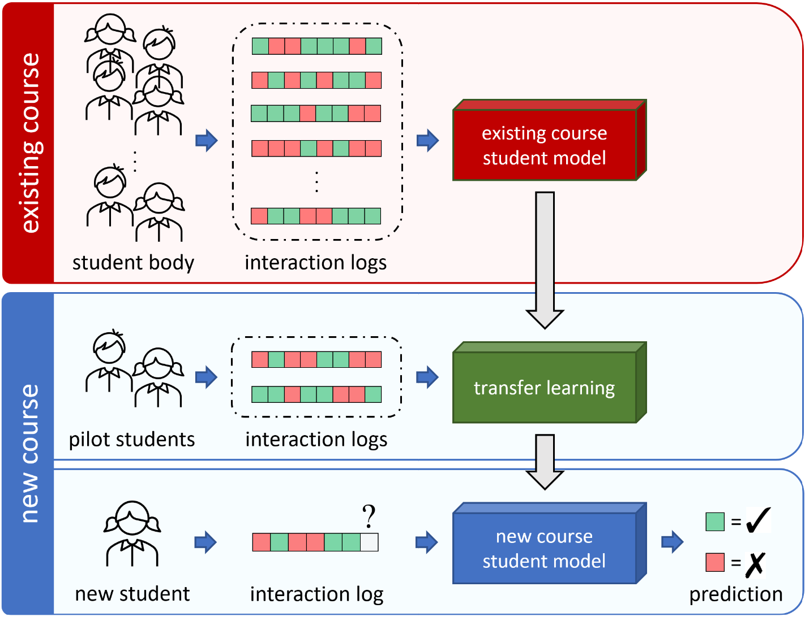

<i>Figure 1.</i> How can we use interaction log data from existing courses to train a student model for performance predictions in a new course for which only a little or no interaction log data is available?

## Feature Descriptions

xxx

## SPM Descriptions

xxx

## Additional Inductive Transfer Plots

Here we provide additional experimental results from our inductive transfer experiments (Section 5.3). Figure 2 compares the performance of our inductive transfer learning method (I-AugLR) with conventional SPM approaches and S-AugLR trained using only target course data $D_T$ for $T \in \lbrace C6, C7, C8, C9, C40\rbrace$. By tuning a pre-trained A-AugLR model, I-AugLR can mitigate the cold-start problem for all five courses and benefits from small-scale log data. Given as little as data from 10 students, the I-AugLR models consistently outperform standard BKT and PFA models that were trained on logs from thousands of target course students (Table 3, Section 5.1). Among all considered SPMs, I-AugLR yields the most accurate performance prediction up to 25 students for $C7$, up to 100 students for $C6$ and $C8$ and up to 250 students for $C9$ and $C40$. Among the non-transfer learning approaches, Best-LR is most data efficient and yields the best performance predictions when training on up to 500 students.

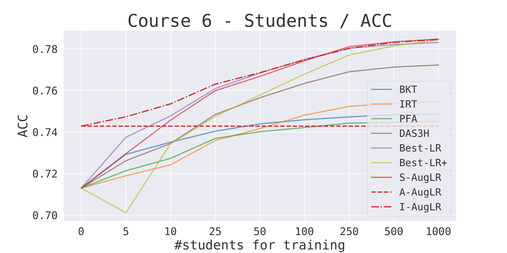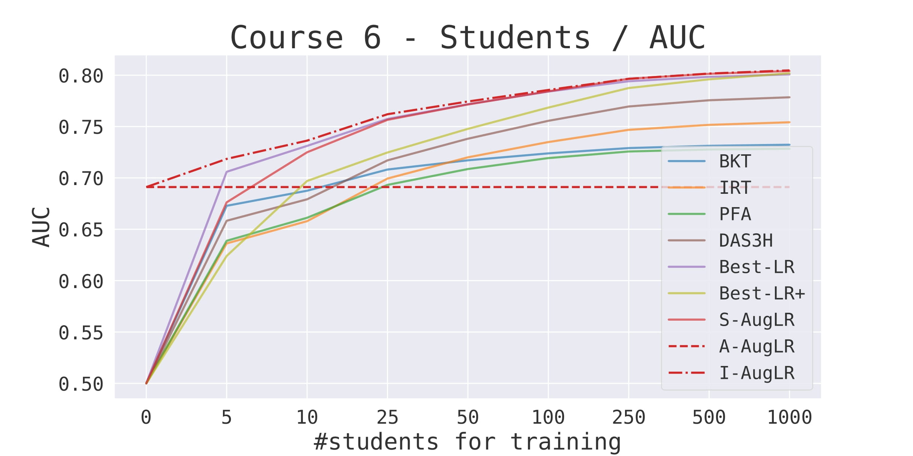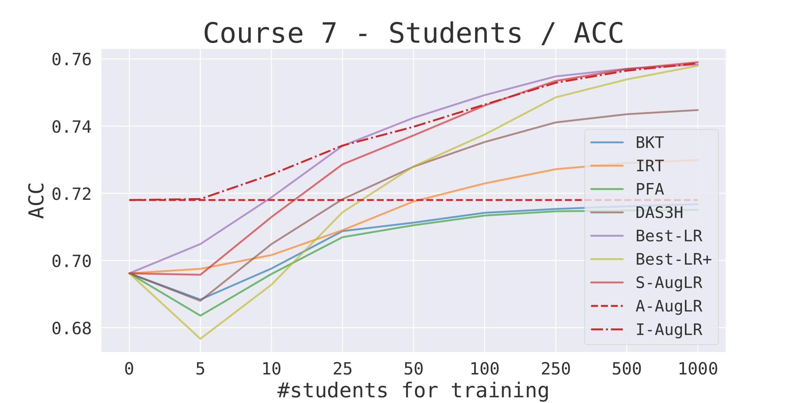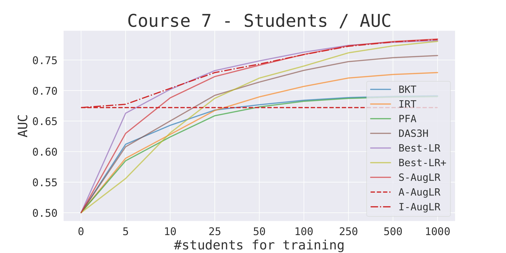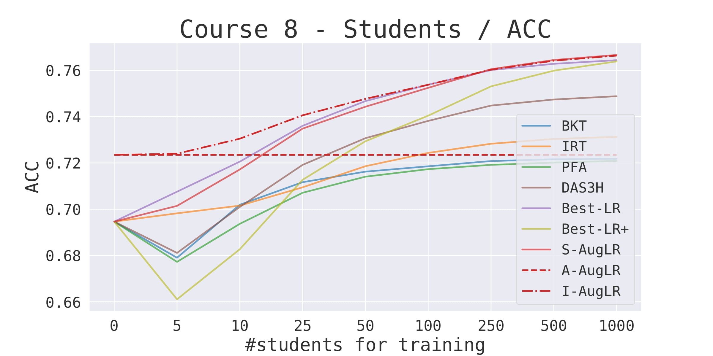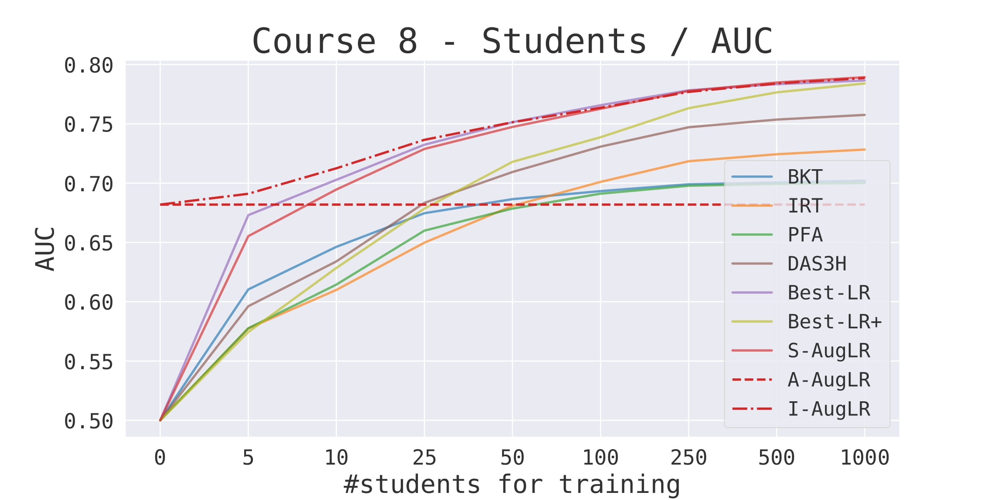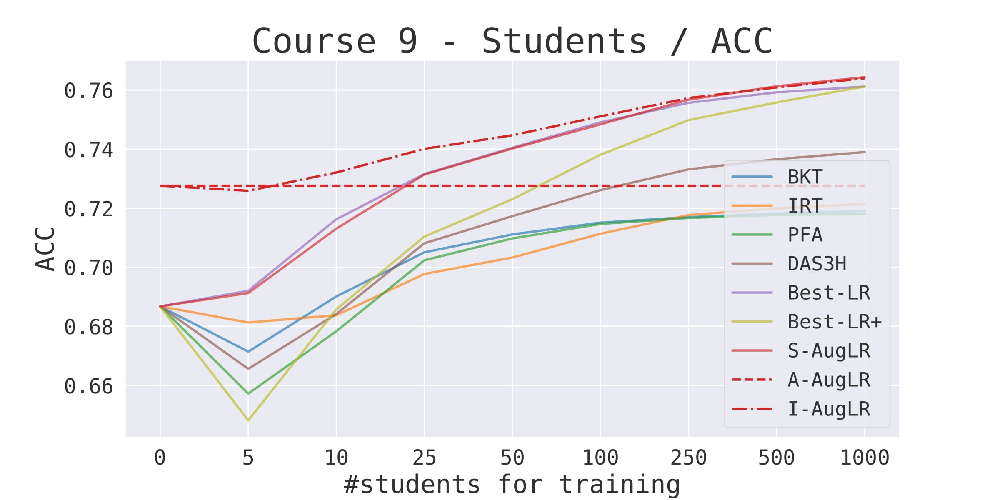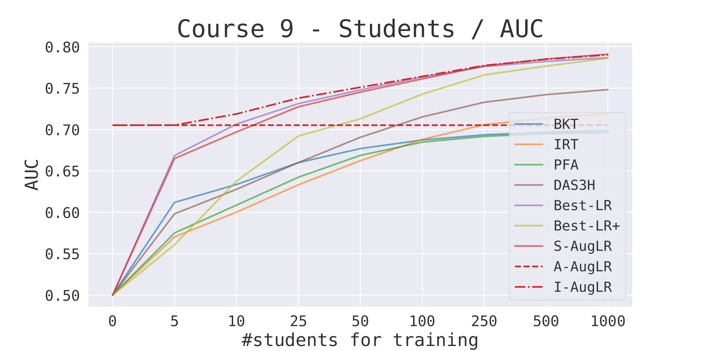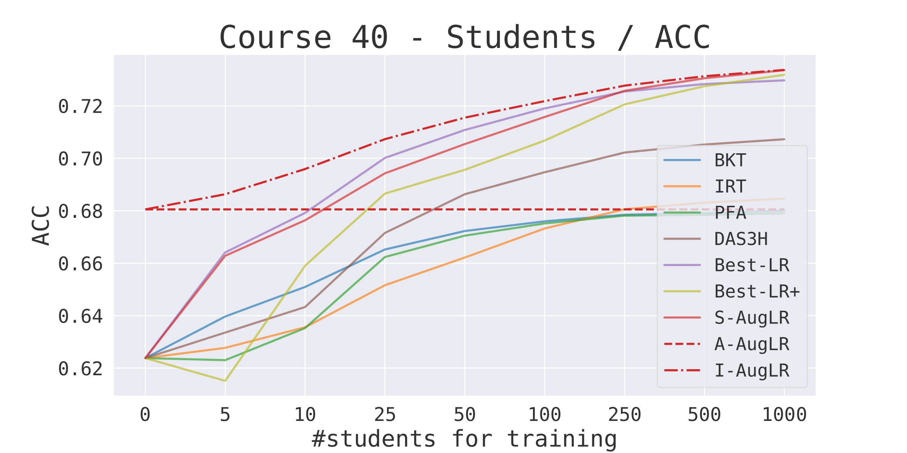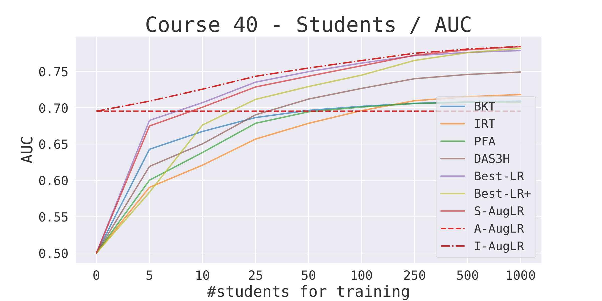

<i>Figure 2.</i> Training student performance models (SPMs) with different amounts of student log data (measured in number of students). For each of the five courses we show ACC/AUC metrics
achieved by the learned SPM. The dashed red line indicates the performance of a course-agnostic A-AugLR model that was pre-trained on student data from the other four courses and did not use
any target course data. The dot-dashed red line indicates the performance of our inductive transfer approach (I-AugLR) which
uses target course data to tune the pre-trained A-AugLR model to the target course. The course-specialized S-AugLR model is identical
to I-AugLR but does not leverage a pre-trained A-AugLR model. All results are averaged using a 5-fold cross validation.

